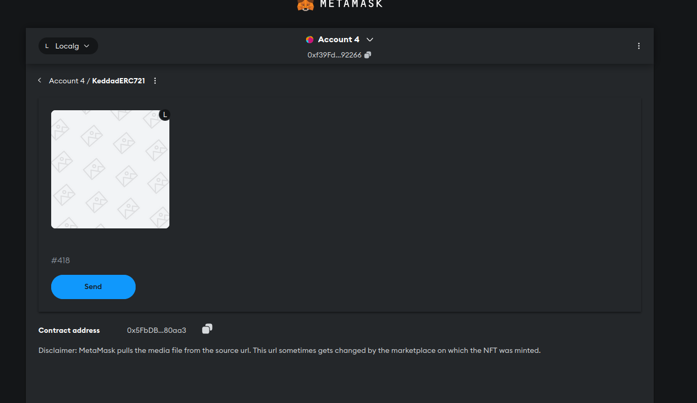
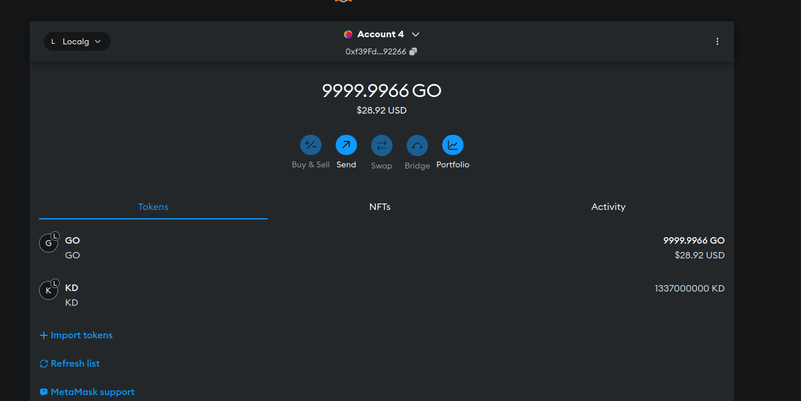

# ДЗ1, Бирюлин Никита Андреевич, БПИ213

* Исходники контрактов доступны в contracts/
* Тесты для кастомных функций - в test/. `npx hardhat test` для запуска
* Деплой-скрипты в ignition/modules (хотя в итоге это не модули, потому что это модули - недокумнетированное барахло).
    Для деплоя в локальной сети (`npx hardhat node`) можно дернуть, например, 
    `npx hardhat run ./ignition/modules/KeddadERC721.js --network local`
* Скрипты для взаимодействия - в scripts/

Контракты успешно разворачиваются в локальной тестовой сети. Лезть в публичные Testnet'ы не стал, там какая-то фигня с ценой деплоя, она не очень дружелюбна к отладке методом тыка.

Если дернуть 

```
npx hardhat run ./ignition/modules/KeddadERC721.js --network local
npx hardhat run scripts/721_tokens_example.js --network local
```

То (попутно продемонстрировав использование функции safeMint) мы получим вполне валидный токен.
Он даже отображается в MetaMask (картинка сломалась, потому что MetaMask, как и hardhat, пример того как не нужно писать ПО):
.

Там же без проблем отображаются кастомные ERC20 токены:


Там же лежат скрипты, которые демонстрируют другой функционал, запрошенный в задании.
(для их использования стоит задеплоить еще и ERC20 токен).

Если после запуска скриптов, демонстрирующих функционал, дернуть скрипт, печатающий память контракта (20_storage_view.js), легко понять, где хранится информация о токенах. (Немного не понял, зачем столько padding'а, но это мелочи жизни).

Там же лежит скрипт, который показывает взаимодействие с Event'ами (20_event_view.js).

Теоретические вопросы:
* Approve нужен для одобрения операций с токенами от твоего имени (например, при обмене токенов)
* ERC 1155 может работать с несколькими токенами (причем разных типов) одновременно. 721 - только один токен на контракт, причем именно NFT.
* SBT - непередаваемый NFT.
* На базе 721 контракта - переопеределив (ну или просто не определив, если контракт пишется с нуля) бы ручки для обмена токенами. Т.е. owner может выдать адресу токен, но пользователь уже не сможет от него избавиться.